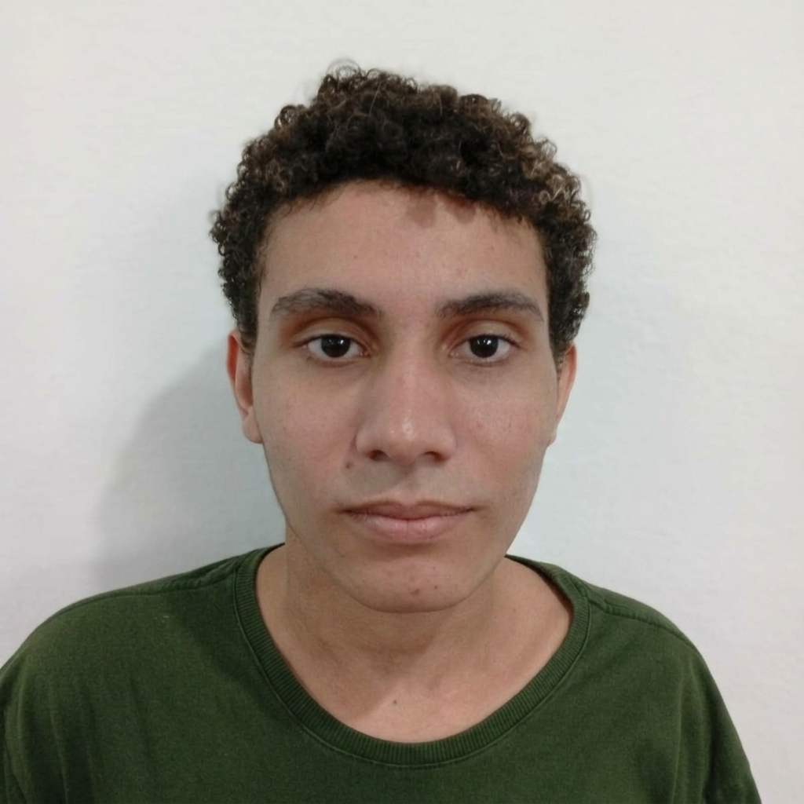
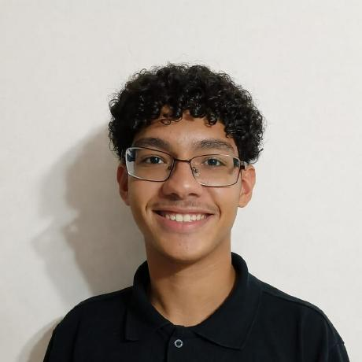

# Projeto de TCC
### Neste repositório irá conter todos os conteúdos do meu projeto do TCC para o curso técnico de Desenvolvimento de Sistemas

---

A ideia principal desse projeto surgiu ao longo do período em que estive no terceiro ano do ensino médio cursando Desenvolvimento de Sistemas, ao descobrir que alguns alunos do segundo ano do mesmo curso tem dificuldades com programação em python

Para resolvermos esse problema, me juntei aos meus amigos para criar um site bem simples e dinâmico com um propósito, ensinar pessoas com dificuldades em programação ou que queiram aprender. No princípio queríamos criar um jogo que juntasse a dinâmica de aprendizado junto a de jogatina, sempre separando o intervalo de cada contratempo

Inspirações para o projeto: The Farmer Was Replaced (Steam) e coddy.tech (Browser)

---

### Projeto em andamento

- [x] Criação do Site
- [x] Tela de Login / Cadastro
- [ ] Exercícios
- [ ] Arte do Jogo

## Colaboradores 

<table>
  <tr>
    <td align="center">
       
      
        <b>Kauã Morato</b>
      
    </td>

  <td align="center">
       
      
        <b>Agnaldo Angelim</b>
      
    </td>

  <td align="center">
       
      
        <b>Matheus Sampaio</b>
      
    </td>

  <td align="center">
       
      
        <b>Lucas Gonçalves</b>
      
    </td>
  </tr>
</table>
